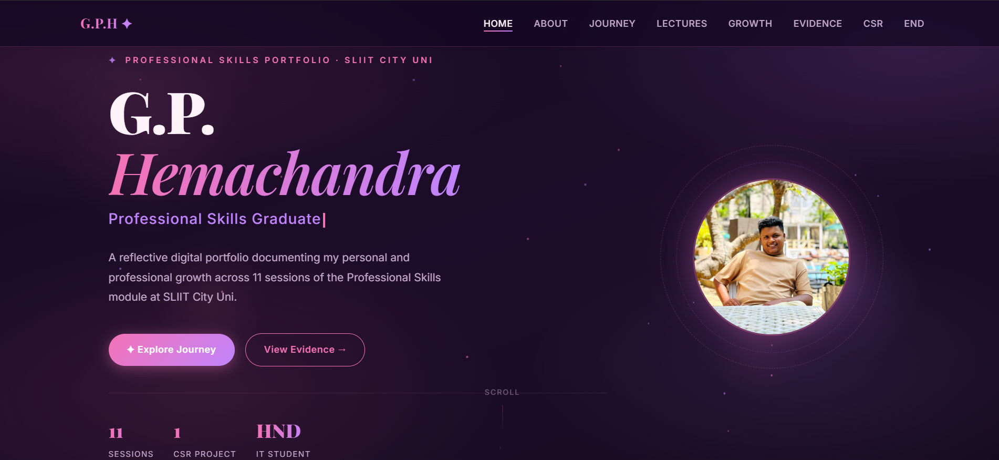

# ✦ G.P. Hemachandra — Professional Skills Portfolio

> A reflective digital portfolio documenting my personal and professional growth across 11 sessions of the Professional Skills module at SLIIT City Uni.

---

---

## 📌 About

This portfolio covers my growth in communication, teamwork, leadership, ethics, and career readiness — documented across 11 professional skills sessions.

🔗 **Live Site:** [View Portfolio](https://your-link-here.com)

---

## 🗂️ Sections

| Section | Description |
|--------|-------------|
| 🏠 Home | Introduction and overview |
| 👤 About | Personal background and values |
| 🛤️ Journey | My development path |
| 📖 Lectures | Reflections on all 11 sessions |
| 📈 Growth | Evidence of improvement |
| 🗂️ Evidence | Artefacts and supporting work |
| 🌍 CSR | Community Social Responsibility project |
| 🏁 End | Final reflection and future goals |

---

## 📊 Stats

- 📚 **11** Sessions completed
- 🤝 **1** CSR Project
- 🎓 **HND IT** — SLIIT City Uni

---

*Made with ✦ · Professional Skills Module · SLIIT City Uni*
